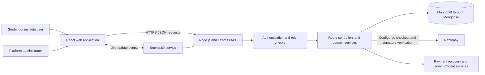
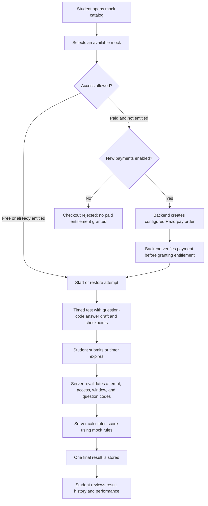
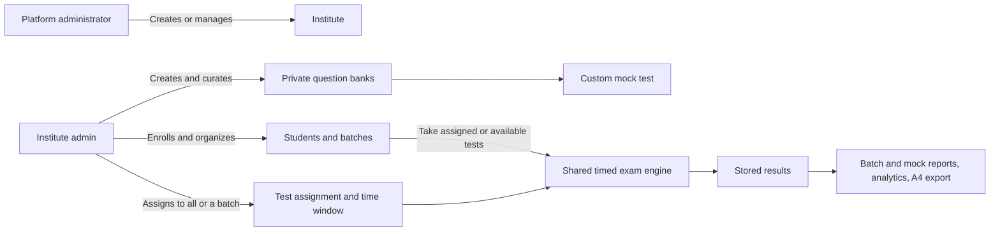

# MockX — Mock Exams and Institute Assessments

MockX is a full-stack platform for timed exam practice, result review, and institute-managed assessments. Students can practise with available mocks, review performance, and continue their preparation. Institutes can manage learners, private question banks, custom exams, assignments, and batch-level reports. Platform administrators manage institutes and platform operations.

## Platform capabilities

### For students

- Browse available mock tests and see backend-configured pricing where checkout is enabled.
- Take timed tests with section and question navigation.
- Save answer progress during an attempt and restore a draft against question codes.
- Submit an attempt for server-side validation and scoring; the server applies the configured mock scoring rules.
- Review result history and performance summaries.
- Receive in-app notifications about account and payment events.

### For institutes

- Manage enrolled students, batches, and institute admins.
- Keep question banks private to the owning institute; organize questions by bank, subject, and topic.
- Build custom mock tests with sections, duration, and marking rules using the shared exam engine.
- Assign tests to an institute or a target batch and set an availability window.
- Review analytics and student results by batch and mock.
- Export question papers and result reports as formatted A4 PDFs; question bank exports can optionally include correct answers.

### For platform administrators

- Manage institutes through the platform administration pages.
- Review transaction and recovery information, registered users, and notification logs.
- Use the payment recovery Copilot panel for supported operational questions.
- Use role-protected routes for platform administration.

### Platform safeguards and recent UI improvements

- Authentication responses use a safe user representation, public registration cannot assign platform-admin privileges, and suspended accounts are rejected at login.
- Result access and final exam submission are authorized on the backend.
- Exam submission rechecks access, assignment and availability rules, validates question codes against the selected mock, calculates marks on the server, and protects finalization from duplicate requests.
- Payment checkout is controlled by the backend `PAYMENTS_ENABLED` setting. Disabling new payments does not grant paid access or invalidate existing purchases; free mocks remain available.
- Backend origins, frontend API URLs, and the optional keep-alive ping are configured through environment variables.
- The landing page, navigation, exam views, result pages, institute dashboards, and administration screens have responsive layouts and a consistent visual theme. The landing page includes an animated preparation comparison; the admin dashboard is split into focused components, with a responsive Copilot panel.

## How MockX works

### Application architecture



The React single-page application calls the Express API using the configured API base URL. Express applies authentication and role checks before protected controller actions. Controllers and services read or update MongoDB through Mongoose. Socket.IO carries supported live-update events. Razorpay is used for checkout when payments are configured and enabled.

### Student exam and result flow



The browser keeps a mock-specific answer draft for recovery, while the backend remains authoritative for final access checks and scoring. The server protects final submission from duplicate requests and does not use client-supplied marks as the final score.

### Institute workflow



Question bank data is scoped to its institute. Institute dashboards organize students, assignments, analytics, and results within institute workflows.

## Technology and source layout

- **Frontend:** React, Vite, React Router, Framer Motion, and GSAP.
- **Backend:** Node.js, Express, REST endpoints, and Socket.IO.
- **Database:** MongoDB with Mongoose models.
- **Payments:** Razorpay integration with backend order creation and verification.
- **Deployment shape:** a persistent Express/Socket.IO service and a separately deployed Vite frontend.

```text
backend/
  src/
    ai/             Admin and payment-recovery AI services
    config/         Runtime, database, token, and payment configuration
    controllers/    API request handlers
    middleware/     Authentication, role, CSRF, and request protections
    models/         Mongoose data models
    routes/         Express route definitions
    services/       Email and real-time services
  test/             Node test-runner suites

frontend/web/
  src/
    api/            API clients and configured API base URL
    components/     Shared navigation and product components
    pages/          Learner, institute, and admin pages
    routes/         Protected-route handling
    styles/         Shared and page-level visual styles
    utils/          PDF export and frontend utilities
```

## Local development

### Requirements

- Node.js compatible with the project dependencies.
- MongoDB locally or a MongoDB Atlas database.
- npm.

### Backend

In PowerShell:

```powershell
cd backend
npm install
Copy-Item env.template .env
```

Set the required development values in `backend/.env`, at minimum `MONGODB_URL` and a strong `JWT_SECRET` (at least 32 bytes), then start the API:

```powershell
npm run dev
```

The backend defaults to port `10000`.

### Frontend

Open another terminal:

```powershell
cd frontend/web
npm install
npm run dev
```

The Vite development server defaults to `http://localhost:5173`. In development, the frontend API client defaults to `http://localhost:10000` if `VITE_API_BASE` is not set.

## Environment and deployment

Use `backend/env.template` as the backend environment reference. Do not commit `.env` files or put server secrets in frontend variables.

| Variable | Where | Purpose |
| --- | --- | --- |
| `MONGODB_URL` | Backend | MongoDB connection string. |
| `JWT_SECRET` | Backend | JWT signing secret; configure a unique strong value per environment. |
| `PORT` | Backend | Host-provided port; defaults to `10000`. |
| `NODE_ENV`, `APP_ENV` | Backend | Runtime and CORS environment behavior. |
| `ALLOWED_ORIGINS` | Backend | Exact frontend origins allowed outside development. |
| `FRONTEND_URL` | Backend | Frontend origin used in email links. |
| `WEBSITE_URL` | Backend, optional | Enables periodic keep-alive pings only when explicitly configured. |
| `PAYMENTS_ENABLED` | Backend | Enables or rejects creation of new payment orders. |
| `PAYMENT_PRODUCT_ID`, `PAYMENT_PRODUCT_NAME`, `PAYMENT_PRODUCT_PRICE`, `PAYMENT_CURRENCY` | Backend | Server-side configuration for the current single purchasable product. |
| `RAZORPAY_KEY_ID`, `RAZORPAY_KEY_SECRET`, `RAZORPAY_WEBHOOK_SECRET` | Backend | Razorpay credentials and webhook verification. |
| `VITE_API_BASE` | Frontend | Backend base URL, without an `/api` suffix; required for production builds. |
| `VITE_SITE_URL` | Frontend | Public site URL used by the deployment configuration. |
| `VITE_RAZORPAY_KEY_ID` | Frontend | Public Razorpay key ID for the checkout client; never put a secret here. |

Changing the frontend or backend domain should be handled through the corresponding environment values and deployment settings, rather than editing API URLs in application components. Use separate databases and credentials for development, staging, and production.

See [backend environment setup](./backend/ENV_SETUP.md), the [deployment guide](./DEPLOYMENT_GUIDE.md), and the [production checklist](./PRODUCTION_CHECKLIST.md) for operational details.

## Useful commands

```powershell
# Backend tests
cd backend
npm test

# Frontend production build
cd frontend/web
npm run build
```

## Related guides

- [Setup guide](./SETUP_GUIDE.md)
- [Deployment guide](./DEPLOYMENT_GUIDE.md)
- [Payment operations](./MANAGE_PAYMENTS.md)
- [Production checklist](./PRODUCTION_CHECKLIST.md)
